## Authentication
Buildog uses Firebase Auth for authentication.

## Setting Up Firebase for Development

Let’s start with creating an Firebase project to begin development. This firebase project only needs and authentication project.
We need a credentials for client side and server side. For server side we will call Firebase Admin.
First, you can go to [firebase console](https://console.firebase.google.com/) to create your project.

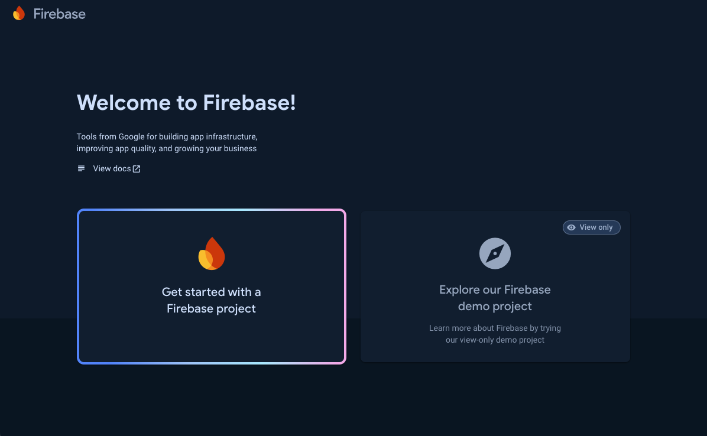

You can directly press the **Get started with a Firebase project** button to create your buildog project. It ask some basic information about project name and Google Analytics. We give "buildog" name to this project and disable the analytics. (In future, we can enable this).

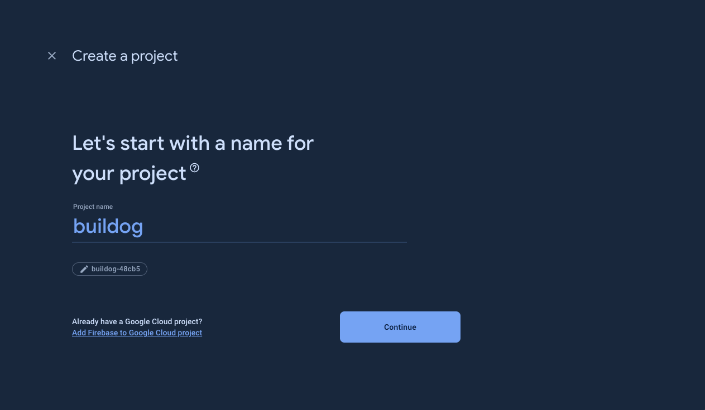

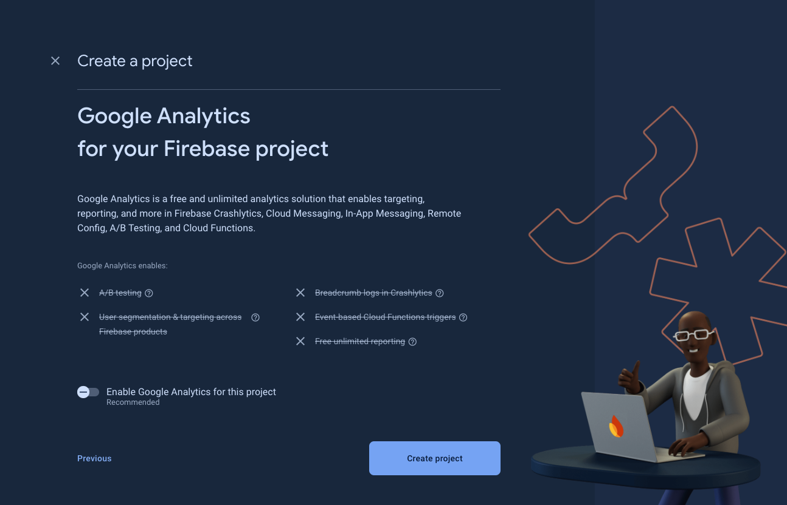

Then, directly press "Create project" button to create. After creation, open the dashboard and go to the **Authentication** page under build dropdown.

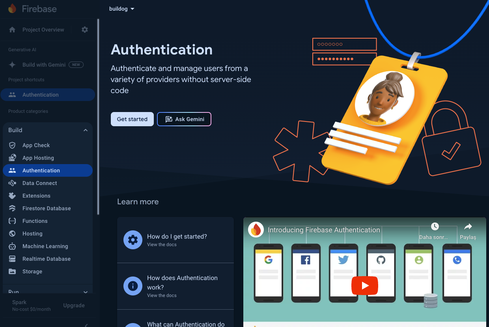

We need to enable authentication with pressing "Get started" button. It generates an authentication system automatically and redirect you to sign-in method tabs. 

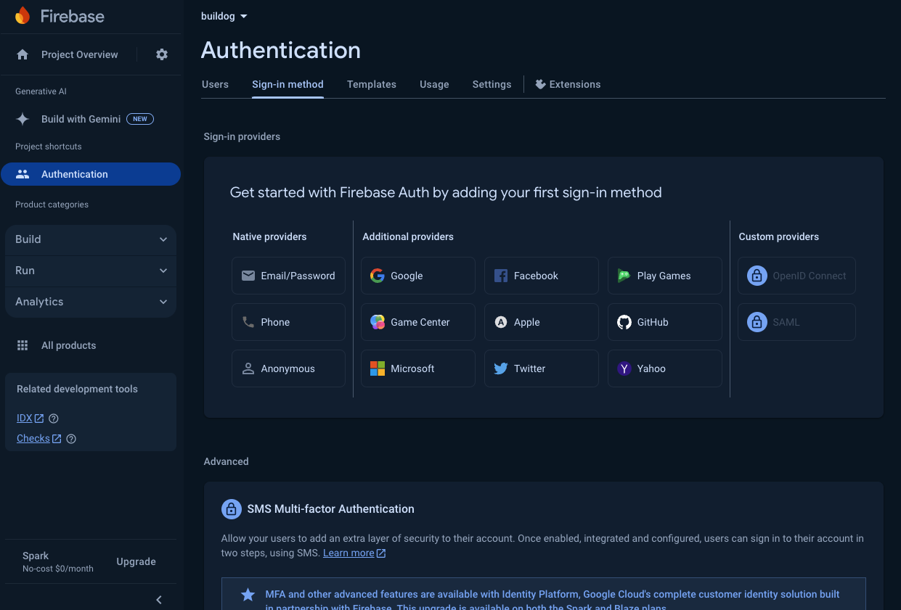

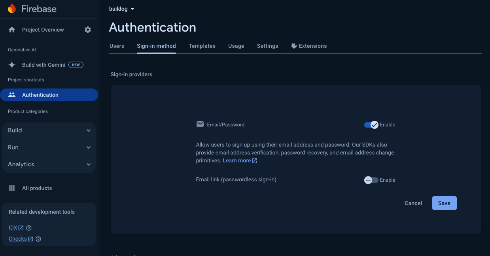

Enable the "Email/Password" and press save. Then you can use email/password authentication. (In future, we can add some other provider like google, github, apple etc.) Let's continue with the adding client keys to our project. First, we need to create those keys. Let's go to the project settings and add a web project under "Your apps" section.

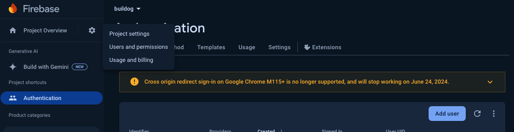

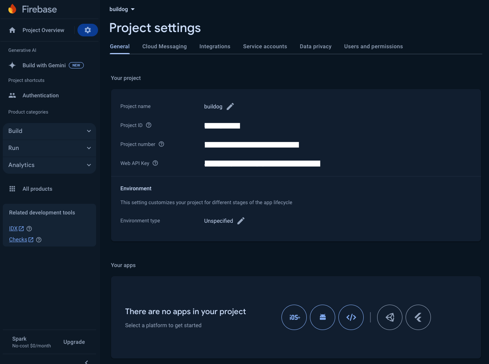

We have to give a name to your web project. I will name it "buildog-web". Then it generates a web project inside our firebase application and give us a sdk keys. After getting these keys we have to move forward the creating .env file but we need to do one more thing. This keys will used by client side and we have to generate keys for Firebase Admin side which means for our backend.

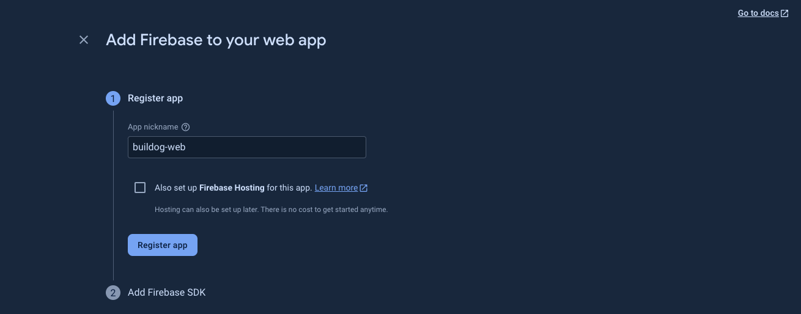

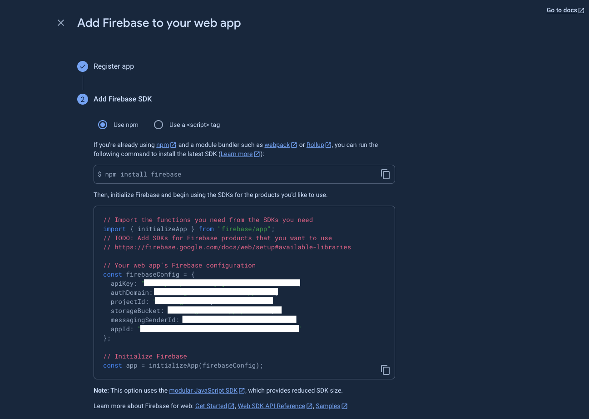

Let's redirect to the service account tab on settings page. It directly shows the Firebase Admin SDK section under that tab. We have to generate new private key for Firebase Admin. Press the **Generate new private key** button. It has to give a json file. Don't forget;

> Your private key gives access to your project's Firebase services. Keep it confidential and never store it in a public repository.


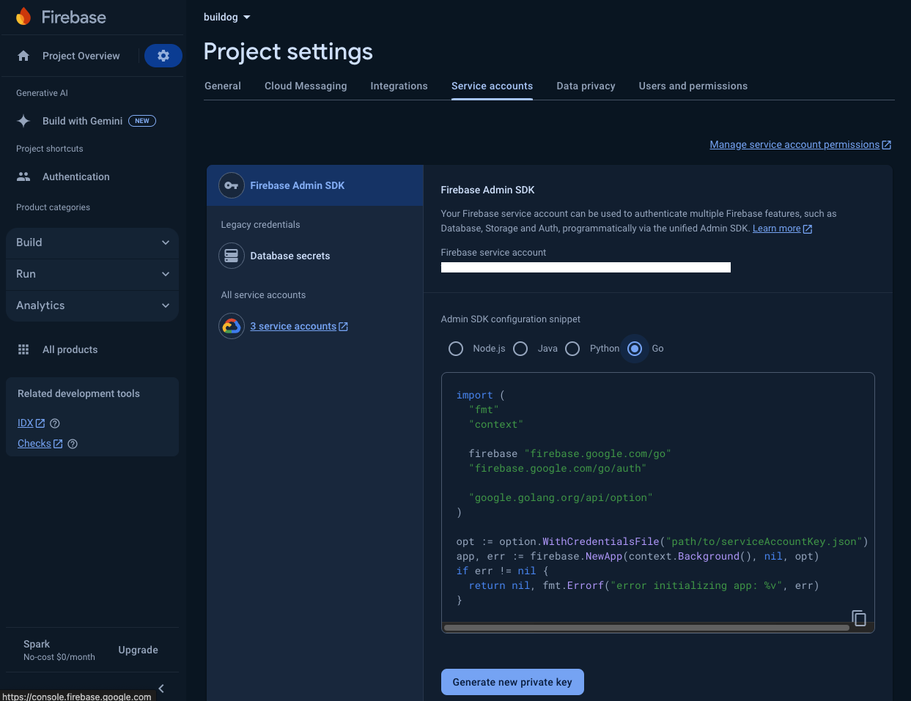

When firebase give you a credentials json file. You have to find the file and move under api folder which I will talk about in a second. We generated our sdk keys and credentials json file. Let's add the sdk keys to our buildog app under apps folder.

```
cd apps/buildog/
```

if it is not created create the .env file and open the .env file in text editor.

```
touch .env
```

if .env file is already exist you can directly add these keys. Go to the firebase console where we created a web application for our project and set these values.

```
NEXT_PUBLIC_FIREBASE_API_KEY=FIREBASE_API_KEY
NEXT_PUBLIC_AUTH_DOMAIN=AUTH_DOMAIN
NEXT_PULIC_PROJECT_ID=PROJECT_ID
NEXT_PUBLIC_STORAGE_BUCKET=STORAGE_BUCKET
NEXT_PUBLIC_MESSAGING_SENDER_ID=MESSAGING_SENDER_ID
NEXT_PUBLIC_APP_ID=APP_ID
```
these sdk keys will used by our sdk which is under packages/web-sdk. It can be public these keys will used by Firebase SDK.

Let's continue with the Firebase Admin side. We already generate the credentials json file. Rename the file to firebase-admin.json. _(Also, it is already in .gitignore)_
And put this file under apps/api folder. Go firebase sdk will reach and initialize the firebase with these credentials. These keys are important and not public be careful. Now, we can test it. Let's go to the terminal, go to the root folder and start the project.

```
pnpm dev
```

Open your browser and go to the http://localhost:3000/ and try to sign up you email and password. You have to get an email confirmation! You can also check firebase console in this step. You have to see your email under users section. After sign up, system automatically redirect you to the sign in page, verify your email and you can sign in the buildog system.
