# Authentication
Buildog uses Auth0 as a authentication provider.

## Setting Up Auth0 for Development

Let’s start with creating an Auth0 project to begin development. This project uses Auth0’s 
embedded login system. The documentation does not contain password-email embedded login. 
Here is an explanation of how to create a development environment.

First, you need an Auth0 account. You can create one directly [here](https://auth0.com/signup). After signing in, the dashboard welcomes you. Let’s create an API in the applications section. The image below shows the APIs screen.

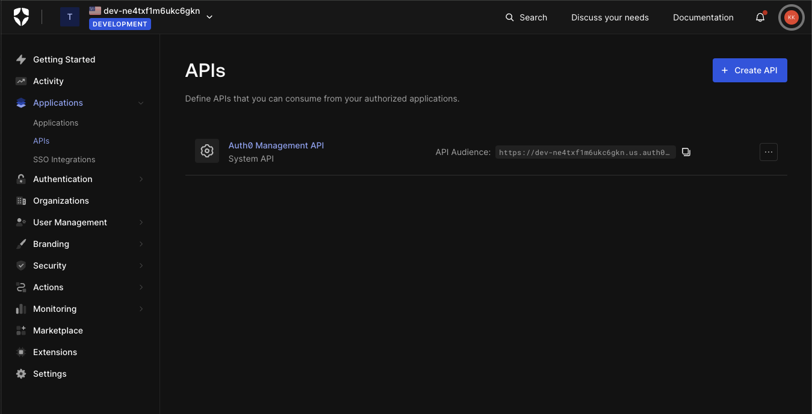

You can directly press the **Create** button to create your first API. There are three inputs here: name, identifier, and signing algorithm. The first two are important. Fill in the blanks and press **Create**. The signing algorithm can remain as RS256.

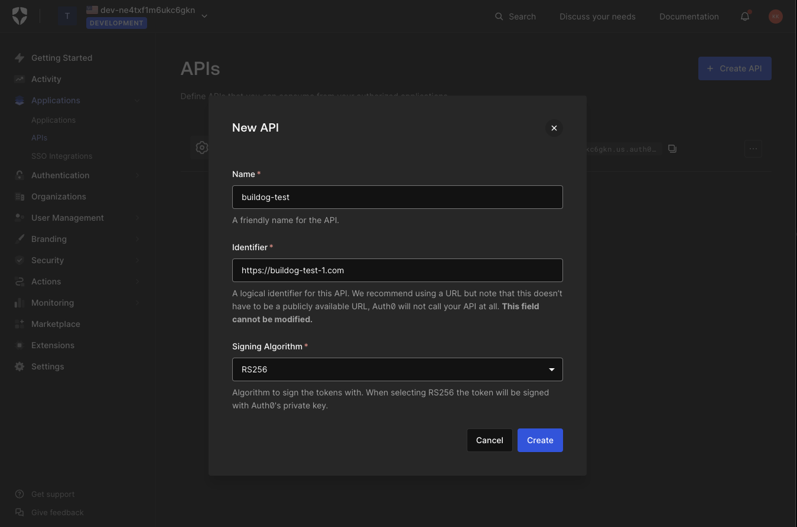

After creating the API, Auth0 redirects you to the created API page. It might show a Quickstart section button, but that doesn’t matter. Just follow this documentation, as Auth0’s documentation can be a bit messy. When we create an API, Auth0 automatically creates an application for that API. You can go to the applications and check it. Press the project created; it will say **(Test Application)** next to it.

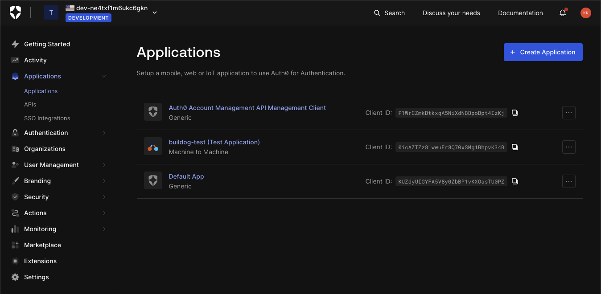

Let’s go to the **Settings** section and scroll to the bottom to reach **Advanced Settings**. We need to change the **Grant Types** to enable password login. Open the advanced settings and select the **Grant Types** tab. You will see a couple of **Grants** under this. The important ones right now are **password** and **refresh token**. Select the password and refresh token options. Make sure to save your changes.

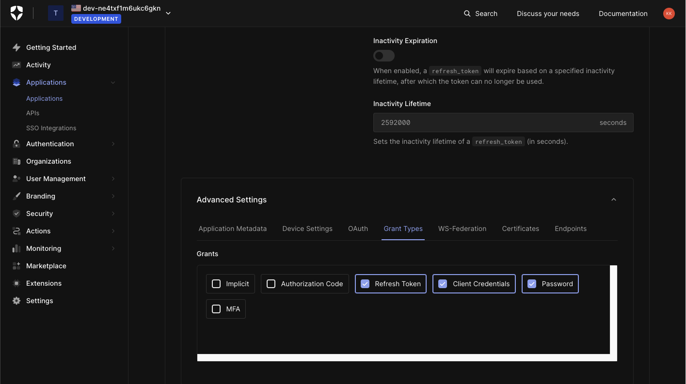

Now that we have enabled the refresh token and password, go back to the APIs page and select our API. Then, in settings, we need to open **Allow Offline Access** to get 'refresh_token' in the response.

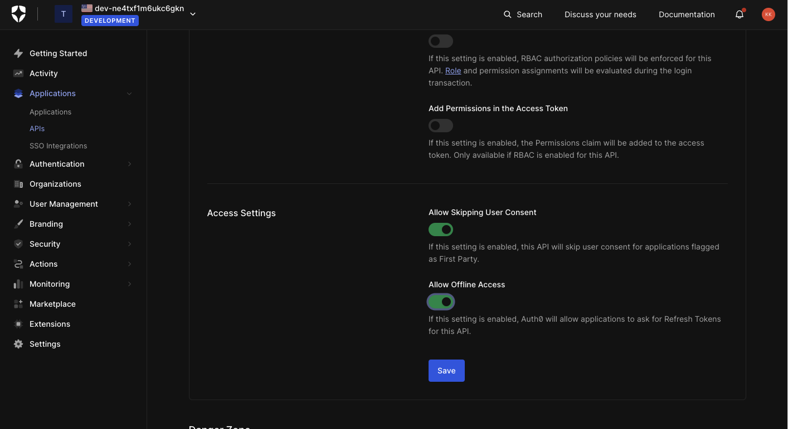

### API Authorization Settings

The second step is API authorization settings. We need to specify which database we are using for this application. On the sidebar, go to **Settings > General > API Authorization Settings**.

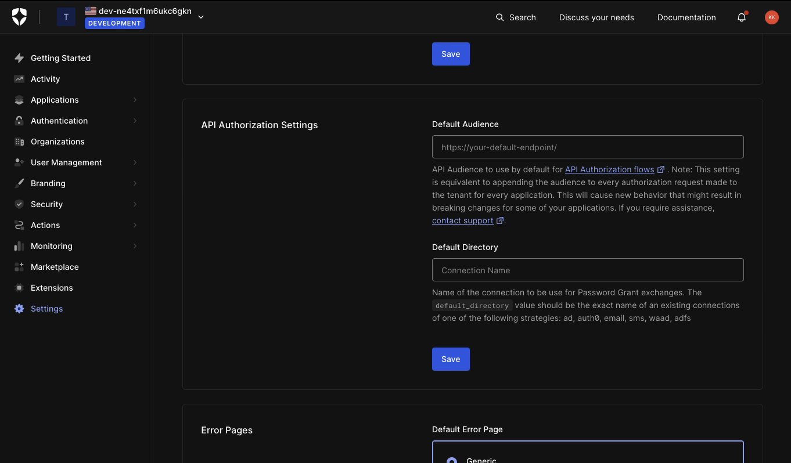

Here, we need to input our database name into the **Default Directory** field. The default database name is **Username-Password-Authentication**. *You can check the database name under Authentication > Database.* Type your database name in the default directory input and press save.


Our Auth0 configuration is now complete! Let’s get our credentials and try to obtain some 'access_tokens'. Let's get our hands dirty. *If you haven't forked the project yet, you need to fork it and clone it to your local environment.*

### Step Three: Setting Up .env File

You need to create an '.env' file for our backend application under **apps/api**. This '.env' file must include the following keys. These keys are necessary because we need to reach Auth0 by sending a Go client request.

```env
AUTH0_CLIENT_SECRET=
AUTH0_CLIENT_ID=
AUTH0_DOMAIN=
AUTH0_AUDIENCE=
```

Let's return to Auth0 to get the client secret, ID, domain, and audience. (Applications > {your project name} (Test Application) > Settings) You can directly copy your client secret, domain, and ID under the **Basic Information** section.

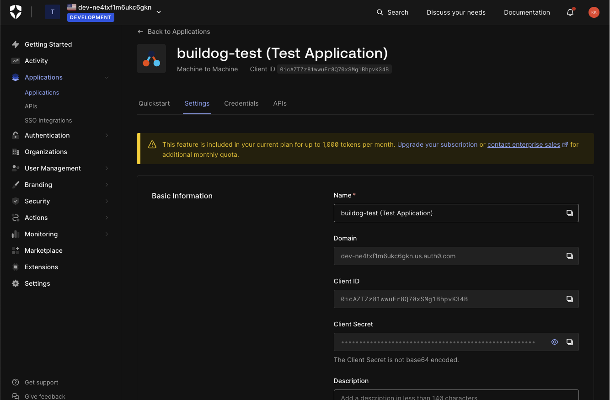

You can find the audience in the APIs page.

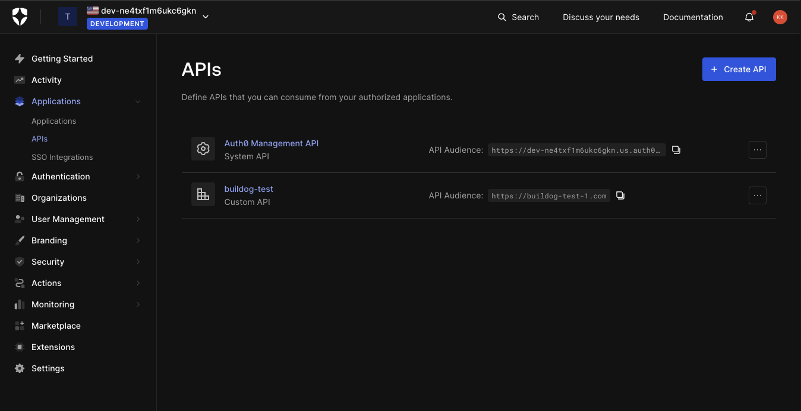

After creating the API, go to the API settings and copy the identifier. Now, we can use the identifier as an audience parameter.

If you followed the steps correctly, your code should now look like this: *(Don’t try to use these keys because they’ve already been removed.)*

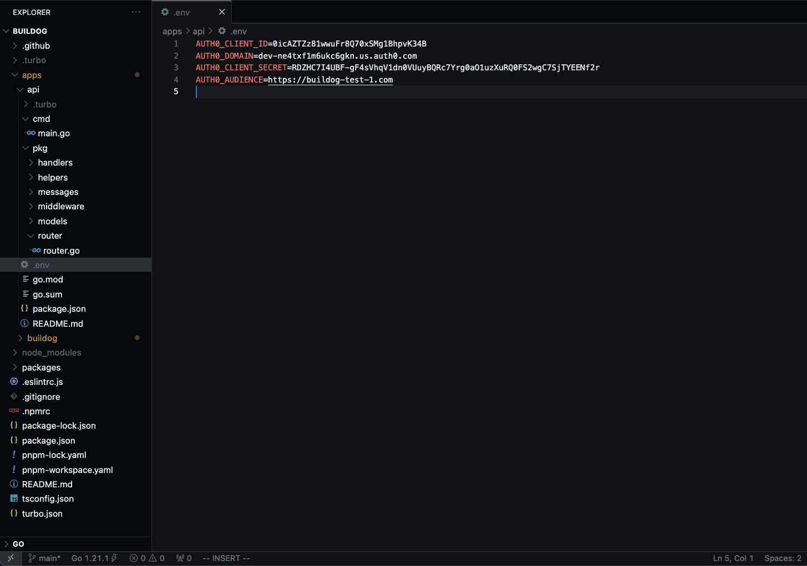

### Creating a User on Auth0

Before making a request to our API, we need to create a user on the Auth0 dashboard. Go to **User Management > Users** and create a test user. I suggest using your own email address to receive the verification email.

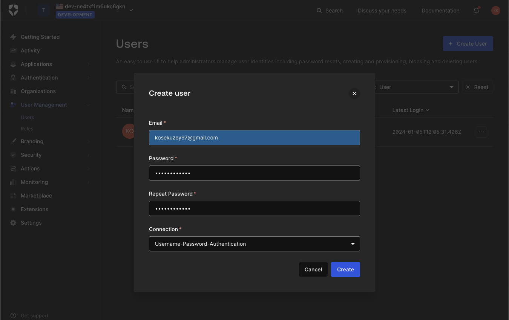

After creating your email, you will receive a confirmation email from Auth0. Confirm your email.

Now, we are ready to get an 'access_token'. Go to the terminal and run the application with 'pnpm dev'. Our backend runs on [http://localhost:3010/](http://localhost:3010/).

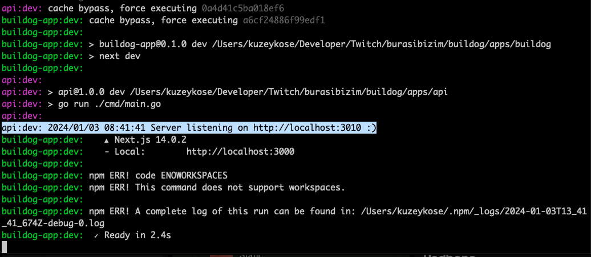

### Testing with Postman

Let's experiment with Postman. The login endpoint for our backend is set at 'localhost:3010/auth/login'. To proceed, you'll need to submit your email and password to this specific endpoint.

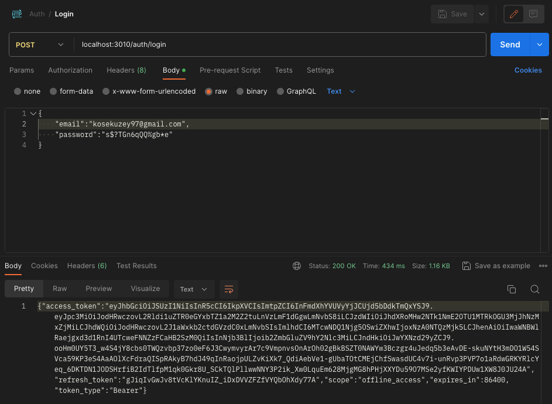

