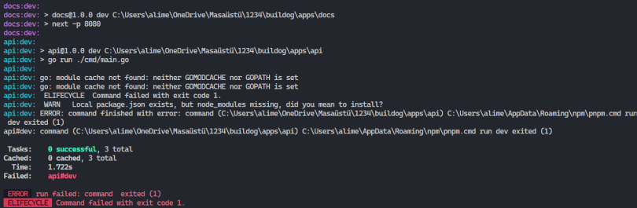

## Environment Variables

Buildog requires environment variables for its projects. In this document, you will find instructions on how Buildog uses tools and technologies such as PostgreSQL and Google Firebase. Before diving into the documents, we need to create `.env` files.

- apps/api
- apps/buildog

```bash
cd apps/api
touch .env
cd ../..
cd apps/buildog
touch .env
cd ../..
```

After creating the `.env` files, you need to add your first environment variable in the Buildog application. Open the `apps/buildog/.env` file in your IDE or text editor. Our first environment variable is `NEXT_PUBLIC_SERVICE_BASE_URL`. This variable helps Buildog's web application connect to the backend via the web SDK. For development, our backend service runs on `localhost:3010`, so we need to provide this URL to our SDK.

```bash
NEXT_PUBLIC_SERVICE_BASE_URL=http://localhost:3010
```

You can continue with the Authentication and Database documentation. We recommend following the documents in order:

1. [Authentication](https://docs.buildog.dev/getting-started/authentication/)
2. [Database](https://docs.buildog.dev/getting-started/database/)

After following the documentation, your `.env` files should look like the given examples:

- _apps/buildog_
```bash
NEXT_PUBLIC_FIREBASE_API_KEY=firebase-api-key
NEXT_PUBLIC_AUTH_DOMAIN=auth-domain
NEXT_PUBLIC_PROJECT_ID=project-id
NEXT_PUBLIC_STORAGE_BUCKET=storage-bucket
NEXT_PUBLIC_MESSAGING_SENDER_ID=messaging-sender-id
NEXT_PUBLIC_APP_ID=app-id

NEXT_PUBLIC_SERVICE_BASE_URL=http://localhost:3010
```

- _apps/api_
```bash
DB_PASSWORD=your-beautiful-password
```

## For Windows Users

After completing the documentation for environment variables, authentication, and the database, you might encounter an error when running pnpm dev, similar to the one shown below:



If you encounter this error on your local machine, run the following commands in PowerShell under buildog project folder to set GOMODCACHE and GOCACHE:

```bash
go env -w GOMODCACHE=$HOME/golang/pkg/mod
go env -w GOCACHE=$HOME\golang\go-build
```

If you face any other issues that you cannot resolve, please open an issue.